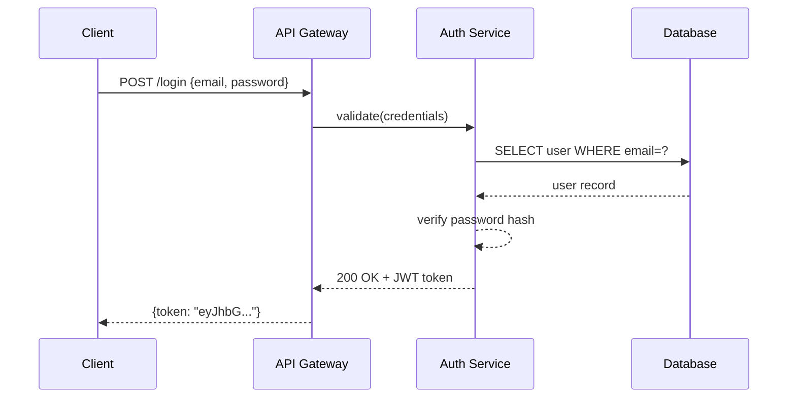
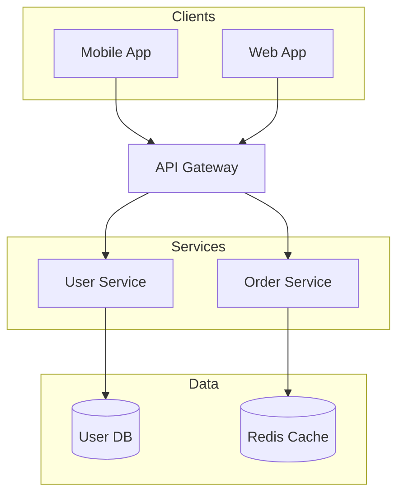
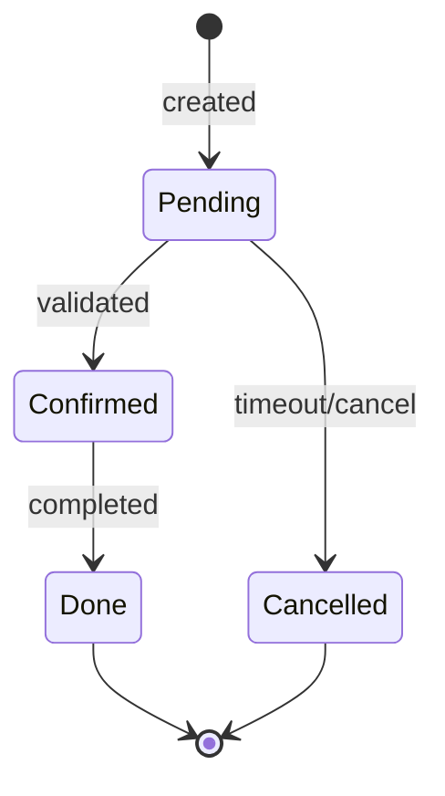

# Mermaid Diagrams

Generate `.mmd` text files and export to PNG/SVG/PDF using `mmdc` (local) or Kroki API (no install).

**Key advantage:** Text-based syntax with **fully automatic layout** — no x/y coordinates needed. Best choice for diagrams embedded in Markdown (GitHub renders them natively).

**Routing:** formal UML / C4 with precise semantics → plantuml-diagrams skill; pixel-controlled or branded diagrams → drawio-diagrams skill.

## Prerequisites

**Option A: Local (mmdc)**
```bash
npm install -g @mermaid-js/mermaid-cli
mmdc --version
```

**Option B: Kroki API (no install)** — just `curl`.

## Workflow

1. **Check deps** — try `mmdc --version`, fall back to Kroki if unavailable
2. **Pick diagram type** — choose from table below
3. **Generate** — write `.mmd` file to disk
4. **Validate** — run validation (REQUIRED before export)
5. **Export** — `mmdc` or Kroki API to PNG/SVG/PDF
6. **Report** — tell user the output file paths

## Validation (Required)

**NEVER export a diagram without validating first.**

```bash
# Validate with mmdc (local)
mmdc -i diagram.mmd -o /tmp/test.png 2>&1

# Validate with Kroki (if mmdc unavailable)
curl -s -X POST -H "Content-Type: text/plain" --data-binary @diagram.mmd https://kroki.io/mermaid/svg -o /tmp/test.svg && echo "Valid" || echo "Invalid"
```

Common validation errors: missing quotes around labels with special characters; wrong arrow syntax (`->>` for sequence, `-->` for flowchart); undeclared participants in sequence diagrams.

## Diagram Types

| Type | Keyword | Use for |
|------|---------|---------|
| Flowchart | `flowchart TD/LR` | processes, pipelines, decisions |
| Sequence | `sequenceDiagram` | API calls, message passing |
| Class | `classDiagram` | OOP models, data structures |
| ER | `erDiagram` | database schemas |
| State | `stateDiagram-v2` | state machines, lifecycle |
| Gantt | `gantt` | project timelines |
| Pie | `pie` | proportions |
| Git Graph | `gitGraph` | branch strategies |
| C4 Context | `C4Context` | high-level architecture |
| Mind Map | `mindmap` | topic breakdowns |

## Examples

### Sequence — JWT authentication



### Flowchart — services architecture



### State machine



## Export Commands

### Option 1: Local (mmdc)

```bash
# PNG (recommended: 2048px wide, white background)
mmdc -i diagram.mmd -o diagram.png -w 2048 --backgroundColor white

# With theme (default | dark | neutral | forest | base)
mmdc -i diagram.mmd -o diagram.png -w 2048 --backgroundColor white --theme neutral

# SVG / PDF
mmdc -i diagram.mmd -o diagram.svg
mmdc -i diagram.mmd -o diagram.pdf
```

### Option 2: Kroki API (no install)

```bash
curl -X POST -H "Content-Type: text/plain" --data-binary @diagram.mmd https://kroki.io/mermaid/svg -o diagram.svg
curl -X POST -H "Content-Type: text/plain" --data-binary @diagram.mmd https://kroki.io/mermaid/png -o diagram.png
```

Use Kroki when `mmdc` installation fails, for quick one-off diagrams, or CI pipelines without Node.js. Note: public Kroki uploads the source to kroki.io — for sensitive content use local mmdc or a local Kroki Docker instance.

## Common Mistakes

| Mistake | Fix |
|---------|-----|
| `mmdc` not found | `npm install -g @mermaid-js/mermaid-cli` |
| Wrong arrow in sequence | `->>` for request, `-->>` for response |
| Special chars in label | Wrap in quotes: `A["Label: value"]` |
| Blank/small output | Add `-w 2048` flag |
| Participant order wrong | Declare `participant` explicitly at top |
| Subgraph name with spaces | Wrap in quotes: `subgraph "My Layer"` |

---

*Source: [Agents365-ai/365-skills mermaid plugin](https://github.com/Agents365-ai/365-skills) (MIT). Upstream auto-update step and external syntax reference files dropped for this vendored copy.*
