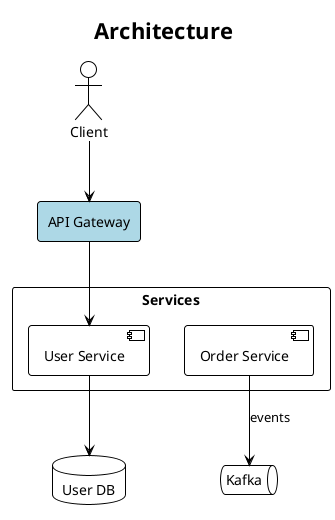
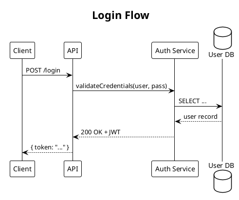
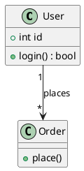
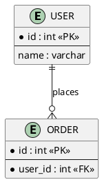
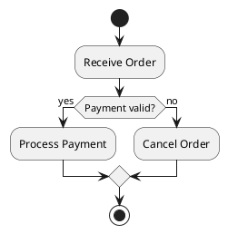
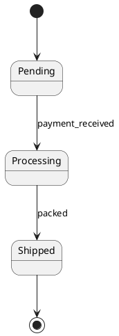
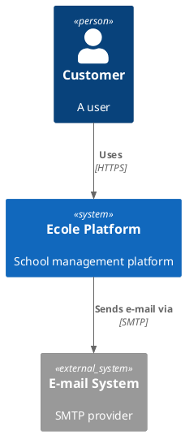

# PlantUML Diagram Skill

## Overview

Generate `.puml` PlantUML diagram files and export to PNG/SVG using **Kroki** — a cloud rendering API that requires no local installation beyond `curl`.

**Format:** `.puml` (PlantUML text) · **Renderer:** Kroki API (`https://kroki.io`) · **Output:** PNG, SVG
**Diagram types:** sequence, component, class, ER, activity, use case, state, C4, mind map, Gantt

Project note: save report diagram sources to `assets/diagram_sources/` and rendered output to `assets/diagrams/`; follow `.ai/diagrams/RULES.md`.

## When to Use

**Explicit triggers:** "plantuml diagram", "sequence diagram", "class diagram", "component diagram", "UML", "activity diagram", "use case diagram", "state machine", "visualize", "architecture chart"

**Proactive triggers:** explaining a system with 3+ interacting components; API flows, authentication sequences; class hierarchies, database schemas, ER models; state machines or lifecycle flows.

**When NOT to use — route elsewhere:** general quick diagrams embedded in Markdown → **mermaid-diagrams**; freeform, heavily-styled, or branded diagrams needing pixel control → **drawio-diagrams**.

## Modes

| Mode | The user wants… | Entry point |
|---|---|---|
| **Generate** (default) | a diagram from a text description | Steps 1–8 below |
| **From code** | a diagram of existing source code | `references/from-source-code.md` → Steps 4–8 |
| **Embed** | PlantUML inside a Markdown doc rendered to images | `references/markdown-embed.md` |
| **Refine** | to change an existing diagram | load its `.puml`, apply the minimal edit (Step 7), re-render |
| **Review** | to know whether an existing diagram is readable/correct | run the Step 6 vision self-check on the image |

## Workflow

### Step 1: Check Dependencies
`curl --version` — available on all modern systems.

### Step 2: Pick Diagram Type
Choose the most appropriate PlantUML diagram type (see reference below).

### Step 3: Generate .puml File
Write the PlantUML source with `@startuml` / `@enduml` markers.

### Step 4: Export via Kroki (capture the HTTP status)
Pick the backend first. The default (public Kroki) **uploads the `.puml` source to kroki.io** — for sensitive diagrams use a local backend instead; see `references/rendering-backends.md`.

```bash
http=$(curl -s -w "%{http_code}" -o diagram.png \
  -X POST https://kroki.io/plantuml/png \
  -H "Content-Type: text/plain" \
  --data-binary "@diagram.puml")
echo "HTTP $http"
```
(SVG: same with `/plantuml/svg` and `-o diagram.svg`.)

### Step 5: Validate & self-correct (loop — do NOT skip)
Treat the export as **failed** if: `$http` is not 200; the file is empty (`[ -s diagram.png ]` fails); or the bytes aren't a real image (`file diagram.png` → "PNG image data"; SVG starts with `<svg` or `<?xml`). Kroki returns 400 on a syntax error and writes the error text into the output file.

On failure: `cat` the output file to read Kroki's error, fix the flagged line, re-run Step 4. Repeat up to 3 times. If a targeted fix doesn't clear it, degrade in order (re-render after each): 1) exotic shapes → plain `rectangle`/`component`/`node`; 2) strip `skinparam`/`!theme`; 3) remove `note` lines; 4) simplify labels, wrap in `"…"`; 5) reduce edges; 6) switch to a simpler diagram type. See `references/kroki-troubleshooting.md`. If it still fails after 3 tries, show the raw Kroki error — never claim the diagram was produced.

### Step 6: Self-check (vision)
After it renders, view the PNG and catch readability problems:

| Check | Fix |
|---|---|
| Label truncation/overrun | Shorten label, wrap in `"…"`, or break with `\n` |
| Components overlap/cramped | `together { }`, layout hints, or split the diagram |
| Wrong orientation/aspect | Switch `left to right direction` ↔ `top to bottom direction` |
| Edge spaghetti | Reorder declarations, group with `package`/`together`, hidden edges |
| Wrong diagram type | Switch type |
| Low contrast | Adjust `skinparam`/`!theme` |

Max 2 self-check rounds; re-render and re-validate after every fix.

### Step 7: Review loop
Show the image, collect feedback, apply the **minimal `.puml` edit** per request, re-render, re-validate. Overwrite the same files each round. After 5 rounds, suggest fine-tuning the `.puml` directly.

### Step 8: Report
Path to `.puml` source, path to PNG/SVG, brief description, and which backend rendered it ("via public Kroki (uploaded)" vs "via local Kroki (stayed local)").

## Diagram Types

| Type | Use for |
|------|---------|
| Sequence | API calls, protocol flows, message passing |
| Component | service architecture, module dependencies |
| Class | OOP models, data structures |
| ER / Entity | database schemas |
| Activity | workflows, business processes |
| Use Case | system requirements, user stories |
| State | state machines, lifecycle |
| C4 Context | high-level system context maps |
| Mind Map (`@startmindmap`) | topic breakdowns |
| Gantt (`@startgantt`) | project timelines |

## Syntax Reference

### Component / Architecture



Shapes: `actor`, `component`, `rectangle`, `database`, `queue`, `cloud`, `node`, `frame`, `package "Name" { }`.
Arrows: `-->` solid, `->` thin, `..>` dashed, `--> :label`, `<-->` bidirectional.
Colors: `#LightBlue`, `#AED6F1`, `#A9DFBF`, `#FAD7A0`, `#F1948A`, `#D7BDE2`.

### Sequence



Arrows: `->` sync, `-->` return, `->>` async, `-[#red]->` colored; `activate A`/`deactivate A`.

### Class



Relationships: `-->` association, `--|>` inheritance, `..|>` implements, `*--` composition, `o--` aggregation; quote multiplicities.

### ER



### Activity



### State



### C4 Context



Use the bundled `!include <C4/…>` form — **never** a remote `!includeurl https://…` (Kroki cannot fetch external URLs).

## Themes

`!theme plain` (recommended), `cerulean`, `blueprint`, `aws-orange`, `vibrant`; or `skinparam` for custom styling.

## Common Mistakes

| Mistake | Fix |
|---------|-----|
| Kroki returns 400 | `cat` the output file — it names the offending line |
| Arrow direction unexpected | Use explicit `-up->`, `-down->`, `-left->`, `-right->` |
| Diagram too crowded | Split or group with `package`/`rectangle` |
| Missing `@startuml`/`@enduml` | Always wrap |
| Special chars in labels | Wrap in quotes |
| C4 includes not found | Bundled `!include <C4/C4_Context>` only |
| Sequence participants out of order | Declare `participant` at top in desired order |

---

*Source: [Agents365-ai/365-skills plantuml plugin](https://github.com/Agents365-ai/365-skills) v1.5.0 (MIT), with Ecole Platform path conventions added.*
