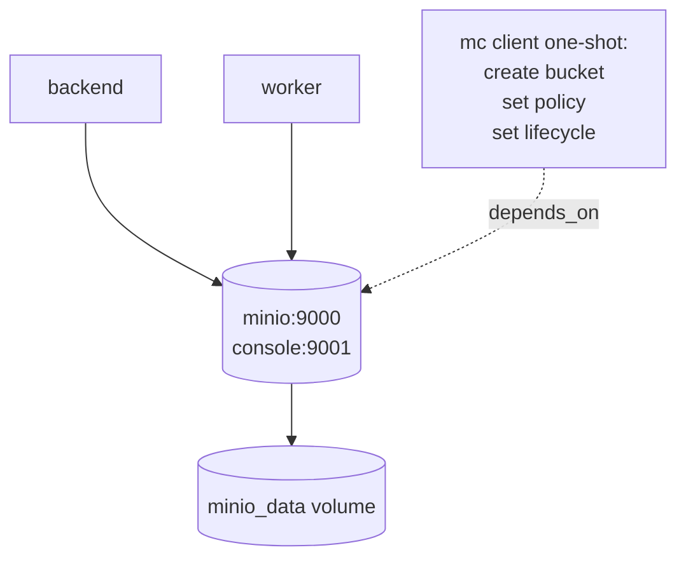

# MinIO Integration — Architecture Proposal

> **Status**: Architecture approved, decisions locked, ready for Phase 1 implementation.
> **Scope**: Introduce MinIO (S3-compatible object storage) to handle videos, PDFs, and audio files in the École Platform without breaking existing logic.
> **Authoring context**: Senior backend architecture review, grounded in the current FastAPI + React/Vite + Flutter codebase.

---

## Table of Contents

1. [Findings — current state of file storage](#1-findings--current-state-of-file-storage)
2. [Target architecture](#2-target-architecture)
   - 2.1 [High-level data flow](#21-high-level-data-flow)
   - 2.2 [Bucket & key layout](#22-bucket--key-layout)
   - 2.3 [Access strategy: private + presigned URLs](#23-access-strategy-private-by-default--short-lived-presigned-urls)
   - 2.4 [Backend storage layer](#24-backend-storage-layer)
   - 2.5 [API design](#25-api-design)
   - 2.6 [Docker integration](#26-docker-integration)
   - 2.7 [Client consumption (web + mobile)](#27-client-consumption-web--mobile)
3. [What needs to change (per layer)](#3-what-needs-to-change-per-layer)
4. [Best practices](#4-best-practices)
5. [Step-by-step implementation plan](#5-step-by-step-implementation-plan)
6. [Decisions locked in](#6-decisions-locked-in)
7. [Phase 1 vs Phase 2 split](#7-phase-1-vs-phase-2-split)
8. [Open questions answered](#8-open-questions-answered)

---

## 1. Findings — current state of file storage

The platform already has a **clean abstraction surface**, which makes MinIO a drop-in rather than a rewrite.

### Two storage layers exist

- `backend/app/core/storage.py` — `StorageBackend` Protocol with `save / read / delete / exists` and a singleton `storage = LocalStorageBackend()`. Used by assignments, submissions, content assets.
- `backend/app/services/file_storage.py` — `FileStorageBackend` Protocol with already-existing `LocalFileStorageBackend` **and** `S3FileStorageBackend` (sync `boto3`). Used by Phase 16 documents (with thumbnails, dedup, virus-scan hook).

### DB stores relative paths

`storage_path`, `file_path`, `exercise_pdf_path`, `thumbnail_path` — these map **1:1 to S3/MinIO object keys**. **No schema migration required.**

### Download endpoints stream bytes through FastAPI

Current pattern: `FileResponse(path, media_type, filename)`. Examples:

- `GET /api/v1/submissions/{id}/files/{file_id}` in `backend/app/api/v1/submissions.py`
- `GET /api/v1/content-items/{id}/assets/{asset_id}` in `backend/app/api/v1/content.py`
- `GET /api/v1/content-items/{id}/stream` (compatibility)
- `GET /api/v1/assignments/{id}/exercise-pdf`

The current S3 backend in `file_storage.py` even **downloads to `tempfile`** to give back a local path → this won't scale for videos.

### Auth model

JWT Bearer everywhere, so clients **cannot** use plain `<video src>` against authenticated routes today.

### Clients already use FormData + progress

- Web: XHR with progress in `web/src/features/submissions/submissions.service.ts` and `web/src/features/cms/cms.service.ts`.
- Mobile (Flutter): Dio `MultipartFile` in `mobile/lib/data/api/api_client.dart`.

### Multi-tenant via `school_id`

The bucket layout must respect tenant boundaries.

### Docker compose

Currently has `postgres / redis / backend / worker / web` and a named volume `upload_data` mounted at `/app/uploads`. **No object storage container yet.** `.env.example` already reserves `S3_ENDPOINT / S3_BUCKET / S3_REGION`, and `app/core/config.py` exposes `document_storage_*` settings.

### Implication

The right move is to introduce a single **S3-compatible backend** that plugs into the existing `StorageBackend` Protocol, swap **byte-streaming for presigned URLs**, and keep DB schema + service logic untouched.

---

## 2. Target architecture

### 2.1 High-level data flow

```mermaid
flowchart LR
    subgraph Clients
      W[Web SPA]
      M[Flutter mobile]
    end

    subgraph Backend[FastAPI backend]
      API[API routes]
      SVC[Service layer]
      STG[StorageBackend\nS3StorageBackend]
    end

    subgraph Storage[MinIO]
      B[(ecole-{env}-private)]
    end

    DB[(Postgres)]

    W -- 1 upload multipart --> API
    M -- 1 upload multipart --> API
    API -- ACL + validate --> SVC
    SVC -- put_object --> STG --> B
    SVC -- write metadata\n(storage_path) --> DB

    W -- 2 GET file metadata --> API
    M -- 2 GET file metadata --> API
    API -- ACL check --> SVC
    SVC -- presign GET --> STG
    API -- 3 returns short-lived URL --> W
    API -- 3 returns short-lived URL --> M
    W -- 4 fetch bytes (Range) --> B
    M -- 4 fetch bytes (Range) --> B
```

**Two key shifts vs. today:**

- **Step 4** moves bytes out of FastAPI for downloads.
- **Step 1** stays the same initially (multipart through backend). Phase 2 introduces presigned `PUT` for very large files (videos).

---

### 2.2 Bucket & key layout

Keep it boring and tenant-aware. **One bucket per environment**, structured prefixes inside.

| Env         | Bucket name              |
| ----------- | ------------------------ |
| development | `ecole-dev-private`      |
| staging     | `ecole-staging-private`  |
| production  | `ecole-prod-private`     |

> Optional second bucket `ecole-{env}-public` only if you ever serve unauthenticated assets like school logos. **Not needed initially.**

#### Key layout (mirrors prefixes already used in services)

The existing `relative_path` becomes the object key as-is:

```
schools/{school_id}/
  exercises/{assignment_id}/{uuid}_{filename}.pdf
  submissions/{submission_id}/{uuid}_{filename}.{ext}
  content/{content_item_id}/{uuid}_{filename}.{ext}
  documents/{sha256[:2]}/{sha256}{ext}            # dedup-friendly (Phase 16)
  documents/previews/{sha256[:2]}/{sha256}.png    # thumbnails
  videos/{course_id}/{uuid}.mp4                   # NEW
  audio/{lesson_id}/{uuid}.mp3                    # NEW
```

#### Why this shape

- **`schools/{school_id}/` prefix** = simple per-tenant lifecycle / quota / deletion / IAM scoping.
- **Content-hash paths for documents** = your existing dedup logic in `store_upload` keeps working.
- **No coupling to bucket** for type — videos vs PDFs vs audio just live under different prefixes. Lifecycle rules apply per prefix.

---

### 2.3 Access strategy: private by default + short-lived presigned URLs

| Concern             | Decision                                                                                |
| ------------------- | --------------------------------------------------------------------------------------- |
| **Default ACL**     | `private` on the bucket; no anonymous reads.                                            |
| **Read access**     | Backend authorizes (JWT + school boundary + role), then issues **presigned GET URL**.   |
| **URL TTL**         | 5–15 min for downloads/PDFs. 10 min default for videos — MinIO honors HTTP Range on a single URL, no need for ultra-short TTLs. |
| **Write access**    | Phase 1: keep multipart-through-backend (no client logic changes).                       |
| **Large uploads**   | Phase 2: introduce presigned **PUT** (init → upload → complete) for videos > 25 MB.      |
| **Server-side**     | Enable **SSE-S3** (default keys) on the bucket.                                          |
| **Audit**           | Existing `AuditService` calls already cover upload/delete — keep them. Don't audit every download URL issue (or sample it). |

---

### 2.4 Backend storage layer

**Aim: add MinIO without forking the abstraction.**

- Implement `S3StorageBackend(StorageBackend)` next to `LocalStorageBackend` in `backend/app/core/storage.py`. Same Protocol, same return shape `(relative_path, sha256, size)`.
- Replace the singleton `storage` selection with a **factory driven by config** (`STORAGE_BACKEND=local|s3`).
- For Phase 16 `services/file_storage.py`, swap the existing **sync** `S3FileStorageBackend` to delegate to the same async client — keep its public methods (`store_upload`, `reuse_upload`, etc.) unchanged so callers don't move.
- **Library**: **`aioboto3`** (async). Reasons:
  - Keeps you cloud-portable (works against MinIO, AWS S3, Cloudflare R2, Wasabi)
  - `boto3` is already a dependency
  - No new SDK lock-in
  - Integrates with FastAPI's async loop
- Add three new methods on the backend Protocol:
  - `presign_get(key, expires_in) -> str`
  - `presign_put(key, expires_in, content_type, max_size) -> str` (Phase 2)
  - `stat(key) -> ObjectStat` (size, etag, content-type, last-modified)
- **Drop the "download to tempfile then `FileResponse`" path** — it's a footgun for videos.

---

### 2.5 API design

Keep all current routes working; **add** a metadata variant that returns a presigned URL. The 302 fallback is what keeps web/mobile working **before** they're updated. Authenticated clients that issue `Authorization` headers and follow redirects (XHR, fetch, Dio) work transparently.

| Action                    | Existing route                                                  | New behavior                                                                 |
| ------------------------- | --------------------------------------------------------------- | ---------------------------------------------------------------------------- |
| Upload submission file    | `POST /submissions/{id}/files`                                  | Unchanged (multipart).                                                       |
| Download submission file  | `GET /submissions/{id}/files/{file_id}`                         | **Default returns 302 redirect** to a presigned URL (still streams to client). Add `?as=metadata` to get JSON `{download_url, expires_at, mime_type, size}`. |
| Stream content asset      | `GET /content-items/{id}/assets/{asset_id}`                     | Same pattern.                                                                |
| Stream first asset        | `GET /content-items/{id}/stream`                                | Same pattern.                                                                |
| Download exercise PDF     | `GET /assignments/{id}/exercise-pdf`                            | Same pattern.                                                                |
| **NEW** large upload init | `POST /uploads/init`                                            | Returns `{upload_url, key, expires_at, max_size}`.                           |
| **NEW** large upload done | `POST /uploads/complete`                                        | Backend HEADs the object, validates size/etag, persists DB row.              |

#### JSON metadata response shape

```json
{
  "download_url": "https://minio.ecole.example.com/ecole-prod-private/schools/.../file.pdf?X-Amz-...",
  "expires_at": "2026-04-30T22:52:00Z",
  "mime_type": "application/pdf",
  "size": 1048576,
  "filename": "exercise_42.pdf"
}
```

---

### 2.6 Docker integration

Add **MinIO** + a one-shot `minio-init` (using `mc`) to dev/staging compose. Production should point to managed MinIO (or AWS S3 / R2) via env vars — same code path.



#### Concrete additions to `infra/docker-compose.dev.yml`

- Add service `minio` (image `minio/minio:latest`)
  - Expose `9000` (S3 API) + `9001` (console)
  - Volume `minio_data:/data`
  - Healthcheck on `/minio/health/live`
- Add service `minio-init` (image `minio/mc`)
  - Waits for healthy `minio`
  - Creates bucket
  - Applies lifecycle (90-day expiration on `schools/*/submissions/`, no expiration on `documents/`, etc.)
  - Enables versioning if needed
- Backend gains env vars:
  - `S3_ENDPOINT=http://minio:9000`
  - `S3_REGION=us-east-1`
  - `S3_ACCESS_KEY=...`
  - `S3_SECRET_KEY=...`
  - `S3_BUCKET=ecole-dev-private`
  - `S3_FORCE_PATH_STYLE=true`
  - `STORAGE_BACKEND=s3`
- Keep `upload_data` volume **only** until the migration script has run; remove afterwards.

#### Staging / production

Same env shape, different endpoint + creds (point at managed MinIO with TLS or to AWS S3).

---

### 2.7 Client consumption (web + mobile)

Both clients already do the right thing for uploads. Downloads should:

1. Call backend metadata endpoint (or follow the 302).
2. Receive a presigned URL.
3. Use the URL with the **native** player/viewer.
4. **Cache the URL** in TanStack Query / Riverpod for ~80% of TTL (e.g. 8 min if TTL is 10 min); refresh on 403.

#### Renderer mapping

| Resource | Web                                                  | Mobile (Flutter)                          |
| -------- | ---------------------------------------------------- | ----------------------------------------- |
| Video    | `<video src={url}>` — browser sends `Range` automatically, MinIO honors it. For HLS later: `<video>` + `hls.js`. | `video_player` package — passes URL directly, gets Range. |
| Audio    | `<audio src={url}>`                                  | `just_audio` or `audioplayers`            |
| PDF      | `<iframe src={url}>` or pdf.js (still uses the same URL) | `flutter_pdfview` with URL or Syncfusion |
| Image    | ``                                    | `Image.network(url)`                       |

---

## 3. What needs to change (per layer)

### Backend

- `app/core/storage.py`: add `S3StorageBackend`, factory, presign helpers.
- `app/services/file_storage.py`: rewire `S3FileStorageBackend` to share the same async client (or thin wrapper); drop tempfile download.
- API routes that currently `FileResponse(...)`:
  - `submissions.py` — submission file download
  - `content.py` — content asset download + stream compatibility route
  - assignment exercise PDF download (in `_helpers.py` flow)
  - student-documents download routes
  - **Switch to**: presigned URL + 302 (default) or JSON metadata (`?as=metadata`).
- `app/core/config.py`: consolidate `S3_*` settings (already partially there). Add `storage_backend` discriminator.
- Add `pyproject.toml` dep: `aioboto3`.
- Add **migration script** `scripts/migrate_local_to_minio.py` that walks `uploads/` and `put_object`s with the same relative path as key. Idempotent (skip if exists).
- **DB**: no migration. `storage_path` is already the right shape.

### Web (`web/`)

- `services/api/client.ts`: add `getDownloadUrl(path)` helper that hits the metadata endpoint.
- `features/submissions/submissions.service.ts`: change `getFile` and any download to fetch metadata then use the URL with `<a href>` / blob / video tag.
- `features/cms/cms.service.ts`: replace `fetchAssetBlob` with metadata-then-URL flow; for video assets render `<video>` directly.
- New shared hook `useSignedUrl(path)` (TanStack Query) with stale-time = 80% of TTL, refetch on 403.
- For **upload progress**: existing XHR pattern stays. Phase 2 adds direct-to-MinIO with a presigned PUT (drop XHR-through-backend for big files).

### Mobile (`mobile/`)

- `data/api/api_client.dart`: add `fetchSignedUrl(path)`; reuse existing `uploadFile` for multipart.
- Replace any in-app download-then-render with `video_player` / `just_audio` / `flutter_pdfview` initialized **directly with the signed URL** (huge UX/perf win, no double buffering).
- Add a tiny URL cache (key by resource id, expiry-aware).

---

## 4. Best practices

### Caching

- **CDN in front of MinIO is optional in dev**, recommended in prod (CloudFront / Cloudflare). Presigned URLs work through CDNs as long as you don't strip the `X-Amz-*` query params.
- **In-client memoization** of presigned URLs (TanStack Query / Riverpod) up to ~80% of TTL — reduces backend load.
- Set `Cache-Control: private, max-age=300` on uploaded objects (use `put_object`'s metadata) so the browser caches per-tab even within the URL TTL.

### Streaming videos

- **Use presigned GET + `<video>` / `video_player`**. MinIO honors HTTP Range; you get scrubbing for free.
- For files > ~50 MB, **always use presigned PUT** (multipart upload) for upload — avoids buffering through FastAPI memory and the 25 MB current limit.
- **Phase 3** (later, only if needed): transcode to **HLS** in a worker (`ffmpeg`) and serve `.m3u8` + segments from MinIO. Don't do this on day 1 — it's the classic over-engineering trap.

### File organization

- One bucket per environment, prefixes per `school_id` and per domain (`exercises/`, `submissions/`, `content/`, `documents/`, `videos/`, `audio/`).
- **Never** put untrusted user filenames in keys — always `{uuid}_{safe_filename}` or content-hash, which both abstractions already do.
- Apply **lifecycle rules** per prefix:
  - `schools/*/submissions/*` → expire after 2 academic years
  - `documents/` → never expire
  - `documents/previews/` → expire 7 days after source deletion
  - `videos/` → review individually
- Enable **versioning** on `documents/` only if your `DocumentVersion` model relies on it (currently it doesn't — versions are full new objects, which is fine).
- Enable **SSE-S3** at bucket level. **KMS not needed** unless you have a regulatory mandate.
- Run an **inventory + cost report** monthly via an admin script.

### Security

- IAM/MinIO policy: backend has full `s3:*` on the bucket; **clients have no direct credentials**.
- Presigned URL TTL ≤ 15 min for sensitive content. Embed `Content-Disposition` for downloads (forces filename on save).
- For uploads (Phase 2), include `Content-Length` and `Content-Type` in the signature to prevent oversized/wrong-mime uploads.
- Validate post-upload via `HEAD` (size, etag) before persisting DB row.
- Keep `virus_scan_hook` — but for direct-PUT, run the scan **post-upload** in the ARQ worker against the MinIO object, then mark the DB row "available". This is the only place the architecture grows by one state, and it's worth it.

---

## 5. Step-by-step implementation plan

Each step is independently shippable. Items marked **(no-op for clients)** keep the contract intact.

| #  | Phase                            | Step                                                                                                                                                                                                                  | Scope                                       |
| -- | -------------------------------- | --------------------------------------------------------------------------------------------------------------------------------------------------------------------------------------------------------------------- | ------------------------------------------- |
| 1  | **Infra**                        | Add `minio` + `minio-init` to `infra/docker-compose.dev.yml`; create `ecole-dev-private` bucket; add env vars.                                                                                                        | infra only                                  |
| 2  | **Config**                       | Consolidate S3 settings in `app/core/config.py`; introduce `STORAGE_BACKEND` switch (default `local` to stay safe).                                                                                                   | backend, no behavior change                 |
| 3  | **Backend: storage backend**     | Implement `S3StorageBackend` in `app/core/storage.py` (`save`, `read` returning a *signed URL/path adapter*, `delete`, `exists`, `presign_get`, `stat`). Add `aioboto3` dep. Add unit tests with `moto` or mocked client. | backend, **(no-op for clients)**            |
| 4  | **Backend: unify Phase 16**      | Rewire `services/file_storage.py`'s S3 backend to share the same async client; drop tempfile path.                                                                                                                    | backend, **(no-op for clients)**            |
| 5  | **Backend: download endpoints**  | Convert PDF/asset/submission/exercise download endpoints to **302-redirect to presigned URL** by default; add `?as=metadata` JSON variant.                                                                            | backend; clients still work via redirect    |
| 6  | **Migration**                    | Write `scripts/migrate_local_to_minio.py`. Run in dev → staging → prod. Verify with checksum sample.                                                                                                                  | data                                        |
| 7  | **Switch backend on**            | Set `STORAGE_BACKEND=s3` per env. Keep `LocalStorageBackend` code; remove `upload_data` mount only after migration confirmed.                                                                                          | infra/config                                |
| 8  | **Web**                          | Add `useSignedUrl` hook + metadata-based download in `submissions.service.ts` and `cms.service.ts`. Switch video/audio/PDF rendering to use signed URLs directly.                                                     | web                                         |
| 9  | **Mobile**                       | Add `fetchSignedUrl` in `api_client.dart`. Wire `video_player` / `just_audio` / `flutter_pdfview` to signed URLs.                                                                                                     | mobile                                      |
| 10 | **Lifecycle & policies**         | Add MinIO lifecycle rules (per prefix) and SSE-S3. Set `Cache-Control` on uploads.                                                                                                                                    | infra                                       |
| 11 | **Phase 2: large uploads (videos)** | Add `POST /uploads/init` + `POST /uploads/complete`. Update web/mobile to PUT directly to MinIO with progress. Move virus scan to ARQ post-upload job. Increase per-file size limit to e.g. 2 GB for videos.        | backend + clients                           |
| 12 | **Observability**                | Add Prometheus metrics: presign rate, upload latency, MinIO 4xx/5xx; Grafana panel.                                                                                                                                   | observability                               |
| 13 | **(Optional later) HLS**         | Add ffmpeg transcode job in worker; produce HLS variants under `videos/.../hls/`; serve `.m3u8`. Only when business demands it.                                                                                       | backend                                     |

> **Phase 1 = steps 1–7**: gives functional MinIO with **zero client changes**.
> **Phase 2 = steps 8–9**: unlocks real video/audio streaming UX.
> **Steps 11–13**: growth, not foundation.

---

## 6. Decisions locked in

| Decision                       | Choice                                                                                                                          |
| ------------------------------ | ------------------------------------------------------------------------------------------------------------------------------- |
| **Bucket strategy**            | One bucket per env (`ecole-{env}-private`); tenant + domain via prefixes (`schools/{id}/{exercises\|submissions\|content\|documents\|videos\|audio}/...`) |
| **Download contract**          | Default `302 → presigned URL`; `?as=metadata` returns `{download_url, expires_at, mime_type, size}`; URL TTL = 10 min            |
| **Library**                    | `aioboto3` (added to `pyproject.toml`)                                                                                           |
| **DB schema**                  | Unchanged — existing `storage_path` / `file_path` columns become MinIO object keys                                               |
| **Auth**                       | Backend authorizes (JWT + school boundary + role) before issuing URL; **no client credentials to MinIO**                         |
| **SSE**                        | SSE-S3 enabled at bucket level                                                                                                   |
| **Phase 1 scope**              | Stop at step 7 (functional MinIO, no client changes) before shipping clients in steps 8–9                                       |

---

## 7. Phase 1 vs Phase 2 split

### Phase 1 — Foundation (no client changes)

| # | Step | Deliverable |
|---|------|-------------|
| 1 | Add `minio` + `minio-init` to `infra/docker-compose.dev.yml`                                | New services + `minio_data` volume + bucket `ecole-dev-private` created with lifecycle rules |
| 2 | Consolidate config in `app/core/config.py`                                                  | Unified `S3_*` vars + `STORAGE_BACKEND=local\|s3` switch (default `local`)                  |
| 3 | Implement `S3StorageBackend` in `app/core/storage.py` using `aioboto3`                      | New backend behind existing Protocol + `presign_get` + `stat`; unit tests with `moto`        |
| 4 | Rewire `services/file_storage.py` S3 backend to share async client; drop tempfile path      | Phase 16 documents flow gets the same client; no API change                                  |
| 5 | Convert download endpoints to default-302 to presigned URL with `?as=metadata` JSON variant | Existing web/mobile keep working via redirect                                                |
| 6 | `scripts/migrate_local_to_minio.py` (idempotent, checksum-verified)                         | Walks `uploads/` → `put_object` with same relative path as key                              |
| 7 | Flip `STORAGE_BACKEND=s3` per env after migration; remove `upload_data` mount               | MinIO is the source of truth                                                                 |

### Phase 2 — Client integration & large uploads (deferred)

- Web/mobile signed-URL hooks (`useSignedUrl`, `fetchSignedUrl`) and direct video/audio/PDF rendering
- Presigned PUT for large uploads (videos > 25 MB) + ARQ post-upload virus scan
- Observability metrics on presign + upload latency

### Phase 3 — Optional growth

- HLS transcoding for video (only when business demands it)
- CDN front (CloudFront / Cloudflare) in production
- Per-school storage quotas + admin reporting

---

## 8. Open questions answered

The four foundational questions have been confirmed:

1. ✅ **Bucket strategy**: one bucket per env with prefixes (recommended).
2. ✅ **Default download contract**: 302 redirect to presigned URL (zero client breakage during rollout).
3. ✅ **Library**: `aioboto3` (async, S3-compatible, cloud-portable).
4. ✅ **Phase 1 scope**: stop at step 7 (functional MinIO, no client changes), then ship clients in steps 8–9.

---

## Appendix A — Reference file paths in the existing codebase

| Concern                          | File                                                                  |
| -------------------------------- | --------------------------------------------------------------------- |
| Generic storage abstraction      | `backend/app/core/storage.py`                                         |
| Phase 16 storage + thumbnails    | `backend/app/services/file_storage.py`                                |
| Document model (storage_path)    | `backend/app/models/documents.py`                                     |
| Submission upload/download API   | `backend/app/api/v1/submissions.py`                                   |
| Content asset upload/download    | `backend/app/api/v1/content.py`                                       |
| Assignment + submission services | `backend/app/services/lms/assignment_service.py`                      |
| Content service                  | `backend/app/services/lms/content_service.py`                         |
| Student documents service        | `backend/app/services/student_documents.py`                           |
| Application config               | `backend/app/core/config.py`                                          |
| Web API client                   | `web/src/services/api/client.ts`                                      |
| Web submissions service          | `web/src/features/submissions/submissions.service.ts`                 |
| Web CMS service                  | `web/src/features/cms/cms.service.ts`                                 |
| Mobile API client                | `mobile/lib/data/api/api_client.dart`                                 |
| Dev compose                      | `infra/docker-compose.dev.yml`                                        |
| Env template                     | `.env.example`                                                        |

---

## Appendix B — Quick environment variable reference (target state)

```bash
# Storage backend selection
STORAGE_BACKEND=s3                          # local | s3

# S3 / MinIO
S3_ENDPOINT=http://minio:9000               # https://minio.ecole.example.com in prod
S3_REGION=us-east-1
S3_ACCESS_KEY=ecole-backend
S3_SECRET_KEY=change-me-strong-secret
S3_BUCKET=ecole-dev-private                 # ecole-staging-private / ecole-prod-private
S3_FORCE_PATH_STYLE=true                    # required for MinIO; false for AWS S3
S3_PRESIGN_TTL_SECONDS=600                  # 10 min default

# (Phase 2) large uploads
S3_PRESIGN_PUT_TTL_SECONDS=900              # 15 min
S3_MAX_UPLOAD_SIZE_MB=2048                  # 2 GB for videos
```

---

**End of proposal.** Ready to start Phase 1, step 1 (`minio` + `minio-init` in `infra/docker-compose.dev.yml`) once you switch to Code mode.
