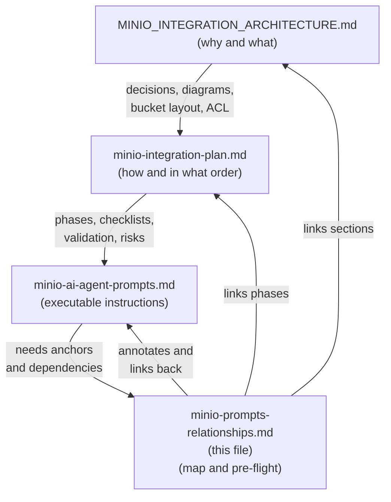
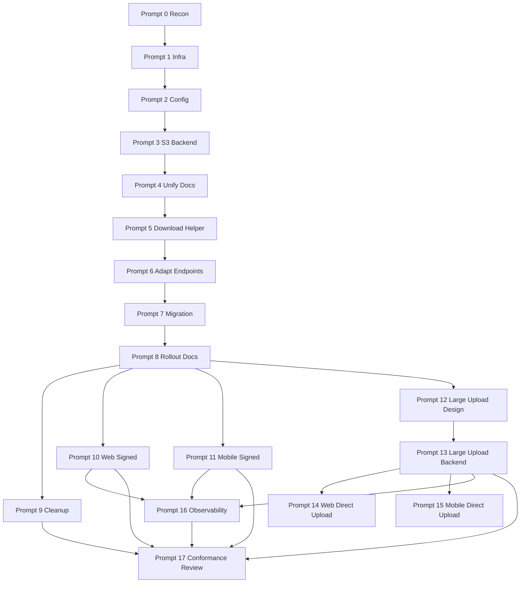
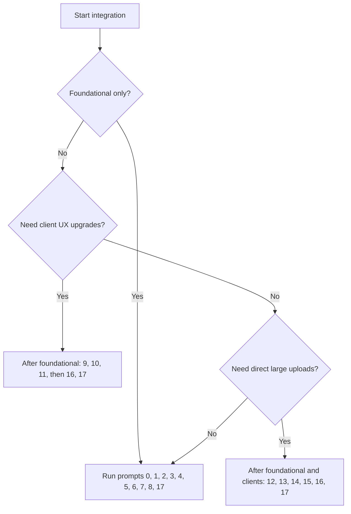

# MinIO Prompts — Review and Relationship Map

> Companion document for `minio-ai-agent-prompts.md`.
> Reviews the prompts, fills the gaps, and maps every prompt to the architecture, the plan, the affected files, and the other prompts it depends on.

---

## Table of Contents

1. [Review Findings](#1-review-findings)
2. [Reusable Pre-Flight Context Block](#2-reusable-pre-flight-context-block)
3. [Three-File Relationship Overview](#3-three-file-relationship-overview)
4. [Cross-Reference Matrix](#4-cross-reference-matrix)
5. [Prompt Dependency Graph](#5-prompt-dependency-graph)
6. [Per-Prompt Enhancement Notes](#6-per-prompt-enhancement-notes)
7. [Execution Path Decision Tree](#7-execution-path-decision-tree)
8. [Copy-Paste Wrapper for Any Agent](#8-copy-paste-wrapper-for-any-agent)

---

## 1. Review Findings

The prompts in `minio-ai-agent-prompts.md` are already strong on:

- Global context contract.
- Architecture decisions repeated as a stable contract.
- Anti-drift rules.
- Validation per prompt.
- Suggested commit per prompt.
- Two execution paths (minimal foundational + optional enhancement).

The following **gaps** are worth filling. They do not require rewriting the prompts file — they can be delivered through this companion document and an optional pre-flight wrapper.

| # | Gap                                                                                          | Severity | How to fix                                                          |
| - | -------------------------------------------------------------------------------------------- | -------- | ------------------------------------------------------------------- |
| 1 | Prompts say "read both docs" without naming the relevant sections                            | Medium   | Cross-reference matrix in Section 4 + Section 8 wrapper             |
| 2 | Prompt-to-prompt dependencies are implicit                                                   | Medium   | Dependency graph in Section 5                                       |
| 3 | Each prompt names input directories but not specific files                                   | Low      | Cross-reference matrix in Section 4 lists target files              |
| 4 | No per-prompt rollback guidance (only Phases 5 / 9 cover rollback)                           | Medium   | Per-prompt notes in Section 6 add rollback hints where useful       |
| 5 | No reusable pre-flight context block (user has to re-anchor every time)                      | Medium   | Section 2 provides a paste-once block                               |
| 6 | No estimated complexity / model fit guidance beyond a tag line                               | Low      | Section 6 adds a complexity rating per prompt                       |
| 7 | No clear mapping prompt → architecture section → plan phase                                  | Medium   | Section 4 cross-reference matrix                                    |
| 8 | No "definition of done" beyond validation list                                               | Low      | Section 6 adds DoD pointers                                         |
| 9 | Observability prompt (16) introduces concepts not anchored in the other docs                 | Low      | Section 6 flags it and points to architecture section 4 / Phase 12  |
| 10 | No explicit "do not modify these files" guard for sensitive prompts                          | Medium   | Section 6 lists out-of-scope files where it matters                 |

> **Conclusion**: the prompts file is fit for use. This companion document adds the cross-references and dependency knowledge an external agent needs to execute prompts correctly.

---

## 2. Reusable Pre-Flight Context Block

Paste this block at the top of any prompt before sending it to an AI agent. It anchors the agent to the right docs and the right rules without you having to retype the global context every time.

```text
PROJECT CONTEXT (read first):
- Repository: École Platform (FastAPI backend, React/Vite web, Flutter mobile).
- Authoritative architecture: MINIO_INTEGRATION_ARCHITECTURE.md
- Authoritative implementation plan: minio-integration-plan.md
- Authoritative prompt catalog: minio-ai-agent-prompts.md
- Companion relationship map: minio-prompts-relationships.md

GLOBAL RULES (always apply):
- Do not change DB schema for foundational MinIO phases.
- Keep existing service-layer authorization authoritative.
- Keep LocalStorageBackend usable for dev/tests.
- One private bucket per environment, prefixes per school_id.
- Backend issues short-lived presigned URLs; clients never receive S3 credentials.
- Default download contract: 302 redirect, JSON metadata via ?as=metadata.
- Use aioboto3 for S3 access from async paths.
- Do not break existing web/mobile clients during Phases 1–5.

EXECUTION RULES:
- Before editing, summarize what you intend to change and why.
- Stop and ask if scope is unclear.
- After editing, list changed files and validation commands.
- Do not auto-run destructive commands.
- Do not modify files outside the declared scope of this prompt.

REFERENCES FOR THIS PROMPT:
- Architecture sections: <FILL FROM SECTION 4 OF minio-prompts-relationships.md>
- Plan phase(s): <FILL FROM SECTION 4 OF minio-prompts-relationships.md>
- Files in scope: <FILL FROM SECTION 4 OF minio-prompts-relationships.md>
- Depends on prompts: <FILL FROM SECTION 5 OF minio-prompts-relationships.md>

NOW EXECUTE THE FOLLOWING PROMPT:
<PASTE PROMPT FROM minio-ai-agent-prompts.md>
```

For agents that only accept a single prompt block, also see Section 8 for a fully assembled wrapper.

---

## 3. Three-File Relationship Overview



**How they cooperate:**

- `MINIO_INTEGRATION_ARCHITECTURE.md` is the **source of truth for decisions** (bucket layout, ACL, presigned URL strategy, Docker integration).
- `minio-integration-plan.md` is the **source of truth for execution sequence** (8 phases, per-phase checklists, validation, risks).
- `minio-ai-agent-prompts.md` is the **agent-ready instruction set** (17 prompts).
- `minio-prompts-relationships.md` (this file) is the **navigational glue** — what each prompt anchors to and what it depends on.

---

## 4. Cross-Reference Matrix

Use this matrix to fill the `REFERENCES FOR THIS PROMPT` block in Section 2.

| Prompt | Title                                | Architecture sections                                | Plan phase(s)         | Primary files in scope                                                                                          |
| ------ | ------------------------------------ | ---------------------------------------------------- | --------------------- | --------------------------------------------------------------------------------------------------------------- |
| 0      | Baseline Recon                       | §1 Findings, §2 Target architecture                  | All (read-only)       | Read-only across `backend/`, `web/`, `mobile/`, `infra/`                                                        |
| 1      | Phase 1 Infrastructure               | §2.6 Docker integration, §2.2 Bucket layout          | Phase 1               | `infra/docker-compose.dev.yml`, `infra/docker-compose.staging.yml`, `infra/docker-compose.prod.yml`, `.env.example` |
| 2      | Phase 2A Config                      | §2.4 Backend storage, Appendix B Env vars            | Phase 2 (Step 2)      | `backend/app/core/config.py`, `.env.example`                                                                    |
| 3      | Phase 2B S3StorageBackend            | §2.4 Backend storage layer                           | Phase 2 (Steps 1–6)   | `backend/app/core/storage.py`, `backend/pyproject.toml`, `backend/tests/test_s3_storage_backend.py`             |
| 4      | Phase 2C Unify Document Storage      | §2.4 Backend storage layer, §1 Findings (two layers) | Phase 2 (Step 5)      | `backend/app/services/file_storage.py`, `backend/app/services/student_documents.py`, related tests              |
| 5      | Phase 3A Download Helper             | §2.5 API design                                      | Phase 3 (Step 1)      | `backend/app/schemas/storage.py` (new), shared download helper module                                            |
| 6      | Phase 3B Adapt Endpoints             | §2.5 API design                                      | Phase 3 (Steps 2–8)   | `backend/app/api/v1/submissions.py`, `backend/app/api/v1/content.py`, assignment exercise PDF route, document download routes, related tests |
| 7      | Phase 4 Migration Script             | §1 Findings (DB stores relative paths), §2.2 Layout  | Phase 4               | `scripts/migrate_local_to_minio.py` (new), `artifacts/`                                                         |
| 8      | Phase 5 Switch Rollout Docs          | §2.6 Docker integration, §3 What changes per layer   | Phase 5               | Docs only: `INSTALLATION.md`, `infra/*.yml` comments, runbook docs                                              |
| 9      | Phase 5B Cleanup Volume              | §2.6 Docker integration                              | Phase 5 (Step 5)      | `infra/docker-compose.dev.yml`, `infra/docker-compose.staging.yml`, `infra/docker-compose.prod.yml`             |
| 10     | Phase 6 Web Signed URLs              | §2.7 Client consumption, §3 Web changes              | Phase 6               | `web/src/services/api/client.ts`, `web/src/features/submissions/submissions.service.ts`, `web/src/features/cms/cms.service.ts`, `web/src/shared/hooks/useSignedUrl.ts` (new) |
| 11     | Phase 7 Mobile Signed URLs           | §2.7 Client consumption, §3 Mobile changes           | Phase 7               | `mobile/lib/data/api/api_client.dart`, video/audio/PDF screens, signed URL cache helper (new)                   |
| 12     | Phase 8A Large Upload Design         | §2.5 API design (Phase 2 row), §4 Best practices     | Phase 8 (design only) | Design report only, no code edits                                                                               |
| 13     | Phase 8B Large Upload Backend        | §4 Streaming videos, §4 Security                     | Phase 8 (Steps 1–4)   | `backend/app/core/storage.py` (presign_put), `backend/app/api/v1/uploads.py` (new), `backend/app/workers/post_upload.py` (new) |
| 14     | Phase 8C Web Direct Upload           | §2.7 Client consumption, §4 Streaming videos         | Phase 8 (Step 5)      | `web/src/services/uploads/directUpload.ts` (new), upload UI components                                          |
| 15     | Phase 8D Mobile Direct Upload        | §2.7 Client consumption, §4 Streaming videos         | Phase 8 (Step 6)      | `mobile/lib/data/api/upload_client.dart` (new), upload UI screens                                               |
| 16     | Observability + Runbook              | §4 Best practices, §3 Per-layer                      | Step 12 of plan       | `infra/prometheus/`, `infra/grafana/`, runbook docs, backend metrics modules                                    |
| 17     | Final Conformance Review             | All sections                                         | DoD section of plan   | Read-only across the repo                                                                                       |

> Note: some "primary files" are net-new (new paths). They are listed because the agent should know where to put new code, not just what to modify.

---

## 5. Prompt Dependency Graph



**Reading rules:**

- **Sequential spine**: 0 → 1 → 2 → 3 → 4 → 5 → 6 → 7 → 8. Do not skip.
- **After Prompt 8 ships**: 9, 10, 11, 12 unlock and can run in parallel teams.
- **Large uploads (12 → 13 → 14 → 15)** is its own sub-track. 13 is design, 14/15 are clients.
- **Observability (16)** can start once Phase 6/7/8 outcomes exist.
- **Final review (17)** must run last and after every phase that the team chose to ship.

---

## 6. Per-Prompt Enhancement Notes

Only meaningful improvements; skip notes for prompts that need none.

### Prompt 0 — Baseline Recon

- **Add** to context: "Especially focus on `backend/app/core/storage.py` and `backend/app/services/file_storage.py` — these are the two existing storage abstractions to converge."
- **DoD**: report explicitly answers "are there any direct filesystem accesses bypassing both abstractions?" with file paths if any.
- **Complexity**: low. Any model fits.

### Prompt 1 — Phase 1 Infrastructure

- **Add** to anti-drift: "Do not modify `backend/` source directory in this prompt."
- **Rollback**: revert the docker-compose.dev.yml chunk; remove `minio_data` volume only if empty.
- **Complexity**: low. Codex / Sonnet / Copilot CLI all fit.

### Prompt 2 — Phase 2A Config

- **Out-of-scope guard**: "Do not implement S3StorageBackend in this prompt; this is config-only."
- **Add** to validation: "Confirm `Settings()` instantiates with `STORAGE_BACKEND=local` and with `STORAGE_BACKEND=s3` plus all S3 vars."
- **Complexity**: low.

### Prompt 3 — Phase 2B S3StorageBackend

- **Add** to anti-drift: "Do not change Phase 16 file_storage.py in this prompt — that is Prompt 4's scope."
- **Rollback**: feature is gated behind `STORAGE_BACKEND=s3` switch; default stays local, so revert is safe.
- **Complexity**: medium. Prefer Sonnet or a competent code model.

### Prompt 4 — Phase 2C Unify Document Storage

- **Out-of-scope**: "Do not modify API routes; that is Prompt 6."
- **Risk** to flag: callers that read the result of `local_path()` as a real filesystem path may break. Agent must enumerate them.
- **Complexity**: medium-high. Sonnet preferred.

### Prompt 5 — Phase 3A Download Helper

- **Add** to context: "The query parameter name should be `as_=metadata` in Python signatures (FastAPI handles the alias to `as`) since `as` is a Python keyword."
- **Complexity**: low.

### Prompt 6 — Phase 3B Adapt Endpoints

- **Hard prerequisite**: Prompt 5 helper must already exist.
- **Add** to validation: "Run the existing endpoint test suite; expect updated assertions, not new endpoint paths."
- **Anti-drift**: "Do not remove existing FileResponse imports until all callers are migrated."
- **Complexity**: medium. Sonnet preferred.

### Prompt 7 — Phase 4 Migration Script

- **Hard prerequisite**: Prompt 3 (S3 backend functional) is done.
- **Risk** to flag: live writes during migration; instruct agent to recommend a maintenance window or a double-write toggle, but not implement double-write here.
- **Complexity**: medium.

### Prompt 8 — Phase 5 Rollout Docs

- **Out-of-scope**: "Do not change application code in this prompt."
- **DoD**: rollout doc lists exact env, exact env-var change, exact rollback command.
- **Complexity**: low.

### Prompt 9 — Phase 5B Cleanup

- **Hard prerequisite**: Prompt 8 rollout has been stable for the agreed grace period (≥30 days).
- **Anti-drift**: "Do not delete `LocalStorageBackend`."
- **Complexity**: low.

### Prompt 10 — Phase 6 Web Signed URLs

- **Hard prerequisite**: Prompt 6 (backend metadata variant exists).
- **Add** to validation: "Browser DevTools should show media bytes coming from MinIO/CDN, not the FastAPI origin."
- **Complexity**: medium.

### Prompt 11 — Phase 7 Mobile Signed URLs

- **Hard prerequisite**: Prompt 6.
- **Risk**: certificate pinning may need updates if MinIO is on a separate domain.
- **Complexity**: medium.

### Prompt 12 — Phase 8A Large Upload Design

- **Output**: design report only, must call out whether DB schema needs additions and which tables.
- **Complexity**: medium. Sonnet / GPT preferred.

### Prompt 13 — Phase 8B Large Upload Backend

- **Hard prerequisite**: Prompt 12 design accepted.
- **Anti-drift**: "Unscanned uploads must not be visible to users."
- **Complexity**: high. Sonnet or SWE-agent preferred.

### Prompt 14 — Phase 8C Web Direct Upload

- **Hard prerequisite**: Prompt 13.
- **Anti-drift**: "Do not remove the existing multipart upload path; keep it for small files."
- **Complexity**: medium.

### Prompt 15 — Phase 8D Mobile Direct Upload

- **Hard prerequisite**: Prompt 13.
- **Anti-drift**: same as Prompt 14.
- **Complexity**: medium-high (mobile resume/expiry handling).

### Prompt 16 — Observability + Runbook

- **Note**: this prompt's scope is broader than what the architecture and plan strictly specify. Architecture §4 mentions monitoring as a best practice; plan step 12 mentions Prometheus + Grafana panels.
- **Anti-drift**: "Never add labels with high cardinality (user id, school id, filename, object key)."
- **Complexity**: medium.

### Prompt 17 — Final Conformance Review

- **Hard prerequisite**: every shipped prompt above is merged.
- **Output**: gap report with severity and go/no-go.
- **Anti-drift**: "Do not modify code; this is review-only."
- **Complexity**: medium.

---

## 7. Execution Path Decision Tree



**Decision aids:**

- If you only need scalable storage + working video/audio with current upload sizes → **Foundational** path.
- If you need smooth video scrubbing and offloaded bandwidth in browser/app → add **Client UX**.
- If you need to upload videos > 25 MB without backend pressure → add **Large Uploads**.

---

## 8. Copy-Paste Wrapper for Any Agent

This is the **fully assembled** wrapper to use when sending a single prompt to an external agent (Claude, ChatGPT, Codex, SWE-agent, Kimi, etc.). Replace the four `<...>` placeholders using Section 4 of this file, then paste the chosen prompt body from `minio-ai-agent-prompts.md` at the bottom.

```text
ROLE
You are a senior software engineer working on an existing enterprise educational platform. You will execute one focused prompt against an existing repository. Stay strictly within scope.

REPO CONTEXT
- Backend: FastAPI (Python).
- Web: React + Vite.
- Mobile: Flutter.
- Storage abstractions already exist:
  - backend/app/core/storage.py (StorageBackend, LocalStorageBackend)
  - backend/app/services/file_storage.py (FileStorageBackend, local + S3-like)
- DB stores relative file paths; no schema change is needed for foundational MinIO rollout.

AUTHORITATIVE DOCUMENTS (read before editing)
- MINIO_INTEGRATION_ARCHITECTURE.md
- minio-integration-plan.md
- minio-ai-agent-prompts.md
- minio-prompts-relationships.md

ARCHITECTURE INVARIANTS (always apply)
- One private bucket per environment: ecole-{env}-private.
- Tenant + domain isolation via key prefixes (schools/{school_id}/...).
- Backend authorizes; clients receive short-lived presigned URLs only.
- Default download contract: 302 redirect; ?as=metadata returns JSON.
- Use aioboto3 in async code paths.
- Keep LocalStorageBackend as fallback; never delete it.
- No DB schema change for foundational phases.

OPERATING RULES
- Before editing, output a short plan: files you will change and why.
- Do not modify files outside the declared scope of the current prompt.
- Do not run destructive commands.
- After editing, list changed files and exact validation commands.
- If anything is ambiguous, ask once and stop.

THIS PROMPT'S SCOPE
- Architecture sections: <FROM SECTION 4 — e.g. §2.4 Backend storage layer>
- Plan phase(s): <FROM SECTION 4 — e.g. Phase 2 Steps 1–6>
- Files in scope: <FROM SECTION 4 — exact paths>
- Depends on prompts: <FROM SECTION 5 — e.g. Prompt 2 must already be merged>

NOW EXECUTE THE FOLLOWING PROMPT FROM minio-ai-agent-prompts.md:

<PASTE THE SELECTED PROMPT BODY HERE — keep its CONTEXT CONTRACT, INPUT, TASK, OUTPUT CONTRACT, ANTI-DRIFT RULES, and VALIDATION sections intact>
```

### Example: filled wrapper for Prompt 3 (S3StorageBackend)

```text
ROLE
You are a senior FastAPI backend engineer.

REPO CONTEXT
(As above.)

AUTHORITATIVE DOCUMENTS
- MINIO_INTEGRATION_ARCHITECTURE.md
- minio-integration-plan.md
- minio-ai-agent-prompts.md
- minio-prompts-relationships.md

ARCHITECTURE INVARIANTS
(As above.)

OPERATING RULES
(As above.)

THIS PROMPT'S SCOPE
- Architecture sections: §2.4 Backend storage layer
- Plan phase(s): Phase 2, Steps 1–6
- Files in scope:
  - backend/app/core/storage.py
  - backend/pyproject.toml
  - backend/tests/test_s3_storage_backend.py (new)
- Depends on prompts: Prompt 2 (config) must be merged.

NOW EXECUTE THE FOLLOWING PROMPT FROM minio-ai-agent-prompts.md:

<paste body of "Prompt 3 — Phase 2B Backend Storage Layer: Implement S3StorageBackend">
```

---

## Appendix — Suggested Quick Improvements to the Prompts File

These are optional. Only apply if you want the prompts file to stand alone without this companion.

- [ ] Add a one-line **"Prerequisites"** field under each `### Objective` (e.g. "Prerequisites: Prompt 5 merged").
- [ ] Add a one-line **"Out of scope"** field where the prompt easily creeps (notably Prompts 1, 2, 4, 5, 8, 9, 17).
- [ ] Replace `?as=metadata` with explicit FastAPI alias guidance (`as_=`) in Prompts 5 and 6.
- [ ] Add an **"Estimated complexity"** tag per prompt: low / medium / high.
- [ ] Add a **"Rollback"** one-liner under each `### Validation`.

If you want, the next step is to apply these inline to `minio-ai-agent-prompts.md` so it remains the single file you copy from.
